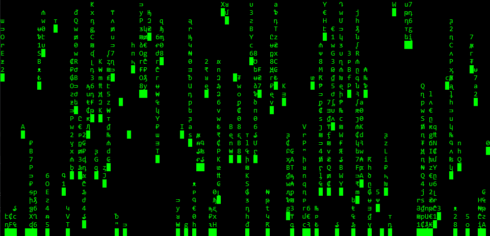

# matrax
Ulgy matrix effect for windows terminal
> The main goal of this ... of that, is to show a cool matrix effect in the default windows terminal. The simplest way possible.

**Using dotnet core 3.1**

# old
This is a first ugly version, just to show what its going to look like.

The next version is going to use the curstor position function tu update last char of a column, and remove top char (with \b) in order to not redraw all the termial.

## Preview
If u really want to take a look at the preview version.

> You need to have a runing *Windows x64*, once it's done you can [download the preview](https://github.com/lostsh/matrax/releases/download/V.01/matrax-webinstaller.zip) version.

### Getting started with preview version
Easy. First extract.
Just click the `matrax.bat` file. On the first run it will download `exe` file and dependances *(into the `bin` folder)*. Then it will launch the executable.

